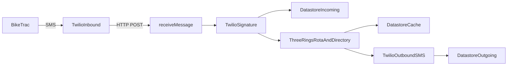

# Architecture

## Summary

Beeper is a single HTTP Cloud Function (`receiveMessage`) that validates a Twilio SMS webhook, resolves who is on call from Three Rings, and forwards the alert body via Twilio SMS. Datastore stores an audit log of inbound/outbound messages and caches Three Rings API responses.

## Components

| Component | Responsibility | Location |
|-----------|----------------|----------|
| HTTP handler | Orchestrate validate → log → lookup → SMS | [`src/index.ts`](../../src/index.ts) |
| Webhook validation | Verify `X-Twilio-Signature` | [`src/twilio-webhook.ts`](../../src/twilio-webhook.ts) |
| Config | Env vars and `ENABLE_CONTROLLER_ALERTS` | [`src/config/index.ts`](../../src/config/index.ts) |
| Three Rings HTTP repo | Live rota + directory fetches | [`src/repository/ThreeRingsHttpRepository.ts`](../../src/repository/ThreeRingsHttpRepository.ts) |
| Caching repo | Datastore-backed cache decorator | [`src/repository/ThreeRingsCachingRepository.ts`](../../src/repository/ThreeRingsCachingRepository.ts) |
| Three Rings service | Shift matching, phone extraction | [`src/service/three-rings.ts`](../../src/service/three-rings.ts) |
| Message log | Incoming / outgoing Datastore entities | [`src/service/message-log.service.ts`](../../src/service/message-log.service.ts) |
| Logging | Structured logs (pino) | [`src/service/logging.service.ts`](../../src/service/logging.service.ts) |
| Terraform stack | Function, secrets, IAM, Datastore, GCS | [`infrastructure/`](../../infrastructure/) |

## Data / control flow

Happy path:

1. Twilio POSTs a form-urlencoded SMS webhook to `receiveMessage`.
2. Signature is validated against `TWILIO_WEBHOOK_URL`.
3. Inbound message is logged as Datastore kind `IncomingRequest` (key: `SmsMessageSid`).
4. Three Rings rota for today is loaded (cached); shifts of type `Controller` and `Duty Trustee` containing “now” are selected.
5. Each volunteer’s directory entry is loaded (cached); `TelProperty` phones are normalized (`07…` → `+44…`).
6. Outbound SMS is sent with sender ID `BBWales` and the original body. Controllers are included only when `ENABLE_CONTROLLER_ALERTS=true`.
7. Outbound rows are stored as child `OutgoingMessage` entities; response is **204**.

## Key modules

See the component table above. Types for Twilio and Three Rings payloads live under [`src/types/`](../../src/types/). Shared helpers (time, phone redaction) are in [`src/utility.ts`](../../src/utility.ts). Datastore client setup is in [`src/datastore.ts`](../../src/datastore.ts).

## Persistence and caching

| Kind | Purpose |
|------|---------|
| `IncomingRequest` | Audit log of inbound Twilio SMS |
| `OutgoingMessage` | Child entities for forwarded SMS |
| `ThreeRingsCache` | Cached rota (`rota-{YYYY-MM-DD}`) and volunteer (`volunteer-{id}`) JSON |

Database ID in GCP: `beeper-database` (Datastore mode). Local emulator project: `beeper-local`. Cache entries are not TTL-expired.

## Integrations

| System | Direction | Purpose |
|--------|-----------|---------|
| BikeTrac | Inbound (via SMS to Twilio) | Originates bike alert messages |
| Twilio | In + out | Webhook delivery and outbound SMS |
| Three Rings | Outbound HTTP | Rota and volunteer directory / phone |
| GCP Secret Manager | In | API keys and Twilio credentials at runtime |
| GCP Datastore | Read/write | Message log and Three Rings cache |

## Failure modes

- Invalid Twilio signature → request rejected (security depends on signature checks; invoker is public).
- Missing or ambiguous on-call shifts (not exactly one of each role) → handler errors in Three Rings service logic.
- Missing telephone property on a volunteer → cannot forward to that person.
- Feature flag off → Controller is skipped even if on shift (current Terraform default).
- Shared staging stack → last PR deploy wins; webhook URL must be updated if the function URI changes.
