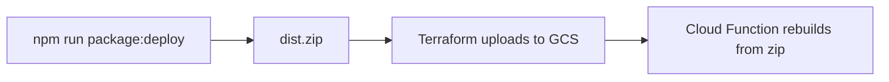

# beeper

A Google Cloud Function that receives inbound SMS alerts from a bike tracking system (BikeTrac) via Twilio, looks up the on-call volunteers from [Three Rings](https://www.3r.org.uk), and forwards the alert to the current Controller and Duty Trustee by SMS.

## How it works

1. BikeTrac sends a Twilio SMS alert to a configured phone number when a tracked bike triggers an event (e.g. theft detection).
2. Twilio forwards the inbound message as an HTTP POST to the `receiveMessage` Cloud Function.
3. The function validates the Twilio webhook signature.
4. The inbound request is logged to Cloud Datastore.
5. The function queries the Three Rings rota to find who is on shift right now as **Controller** and **Duty Trustee** (responses are cached in Datastore).
6. It fetches each volunteer's phone number from the Three Rings directory (also cached).
7. It forwards the original alert body to both volunteers via Twilio SMS and logs each outbound message to Datastore.

## Prerequisites

- Node.js 24+ (matches CI)
- [Google Cloud SDK](https://cloud.google.com/sdk/docs/install) (`gcloud`) with the Datastore emulator component
- Java 21+ (required by the Datastore emulator)
- A [Three Rings](https://www.3r.org.uk) account with API access
- A [Twilio](https://www.twilio.com) account

## Environment variables

Copy `.env.example` to `.env` and fill in the values:

```
THREE_RINGS_API_KEY=   # Three Rings API key
TWILIO_ACCOUNT_SID=    # Twilio account SID (starts with AC...)
TWILIO_AUTH_TOKEN=     # Twilio auth token
TWILIO_WEBHOOK_URL=    # Full webhook URL as configured in Twilio (required for signature validation)
GCP_PROJECT_ID=        # GCP project ID when connecting to live Cloud Datastore (npm run run)
```

For local development with the Datastore emulator, `npm run dev` sets `DATASTORE_EMULATOR_HOST` and `DATASTORE_PROJECT_ID` automatically. You can also set them manually:

```
DATASTORE_EMULATOR_HOST=localhost:8081
DATASTORE_PROJECT_ID=beeper-local
```

`TWILIO_WEBHOOK_URL` must match the URL Twilio posts to exactly (including path and trailing slash). When testing locally behind a tunnel such as ngrok, set this to the public URL Twilio sees.

In production, `GCP_PROJECT_ID` is optional because Cloud Functions sets `GOOGLE_CLOUD_PROJECT` automatically.

## Datastore emulator setup

The app uses Cloud Datastore (Firestore in Datastore mode) to log inbound/outbound messages and cache Three Rings API responses. Local development and integration tests use the [Datastore emulator](https://cloud.google.com/datastore/docs/tools/datastore-emulator) rather than a live GCP project.

### 1. Install the emulator

Install the Google Cloud SDK, then add the emulator component:

```bash
gcloud components install beta cloud-datastore-emulator
```

The emulator also requires a Java runtime (Java 21+ is recommended).

### 2. Start the emulator

In one terminal, start the emulator on port 8081:

```bash
npm run emulator
```

This runs:

```bash
gcloud beta emulators datastore start --project=beeper-local --host-port=localhost:8081
```

Leave this process running while you develop or run integration tests.

### 3. Run the function against the emulator

In a second terminal, start the function with emulator environment variables:

```bash
npm run dev
```

This compiles TypeScript and starts the Cloud Functions Framework on `http://localhost:8080`, targeting the `receiveMessage` function. The Datastore client connects to `localhost:8081` automatically when `DATASTORE_EMULATOR_HOST` is set.

### 4. Run without the emulator

To connect to live Cloud Datastore in a GCP project instead:

```bash
npm run run
```

Set `GCP_PROJECT_ID` in `.env` (or ensure `GOOGLE_CLOUD_PROJECT` is set in the environment).

## Running locally with Twilio

To receive real inbound webhooks from Twilio while developing:

1. Start the Datastore emulator (`npm run emulator`).
2. Start the function (`npm run dev`).
3. Expose port 8080 with a tunnel (e.g. ngrok).
4. Set `TWILIO_WEBHOOK_URL` in `.env` to the tunnel URL, matching Twilio's webhook configuration exactly.
5. Point your Twilio phone number's inbound webhook at the tunnel URL.

## Running tests

```bash
npm test                  # all tests
npm run test:unit         # unit tests only
npm run test:integration  # integration tests only
```

Unit tests mock external dependencies and do not need the Datastore emulator.

Integration tests require the emulator to be running first:

```bash
# Terminal 1
npm run emulator

# Terminal 2
npm run test:integration
```

Tests use [nock](https://github.com/nock/nock) to intercept Three Rings HTTP requests, [supertest](https://github.com/ladjs/supertest) to call the Cloud Function, and [Jest](https://jestjs.io) for assertions. No real Three Rings or Twilio network calls are made.

## Building

```bash
npm run build   # compiles TypeScript to dist/
npm run watch   # watch mode
npm run typecheck  # type-check without emitting
```

## Deployment

Beeper is deployed to Google Cloud using Terraform. The Cloud Function lives in the same Terraform stack as the rest of the infrastructure (GCS bucket, Secret Manager, IAM, Datastore).

### Architecture



Terraform owns:

- GCP project and APIs
- GCS source bucket
- Secret Manager secrets
- Cloud Function (Gen2)
- IAM (invoker, Datastore, secret access)
- Firestore in Datastore mode

CI (or local deploy) owns:

- Building and zipping the Node app
- Running `terraform apply` to publish the artifact

Terraform should not run `npm build`. Build the app first, then pass Terraform the resulting zip.

### Manual deploy

```bash
npm ci
npm run package:deploy

cd infrastructure
terraform init
terraform apply
```

`npm run package:deploy` compiles TypeScript to `dist/` and creates `dist.zip`. Terraform uploads that file via `google_storage_bucket_object` and updates the Cloud Function when the source changes.

### Recommended CI deploy workflow

CI currently lints Terraform and runs tests, but does not deploy. A deploy workflow on `main` should:

1. Run unit and integration tests
2. Run `npm run package:deploy`
3. Run `terraform apply` with GCP credentials

Example shape:

```yaml
name: Deploy

on:
  push:
    branches: [main]

jobs:
  deploy:
    runs-on: ubuntu-latest
    permissions:
      contents: read
      id-token: write

    steps:
      - uses: actions/checkout@v4

      - uses: actions/setup-node@v4
        with:
          node-version: 24

      - run: npm ci
      - run: npm run test:unit
      - run: npm run package:deploy

      - uses: hashicorp/setup-terraform@v3

      - uses: google-github-actions/auth@v2
        with:
          workload_identity_provider: ${{ secrets.GCP_WORKLOAD_IDENTITY_PROVIDER }}
          service_account: ${{ secrets.GCP_SERVICE_ACCOUNT }}

      - name: Terraform apply
        working-directory: infrastructure
        run: |
          terraform init
          terraform apply -auto-approve
        env:
          TF_VAR_project_id: ${{ secrets.GCP_PROJECT_ID }}
          TF_VAR_billing_account: ${{ secrets.GCP_BILLING_ACCOUNT }}
          TF_VAR_three_rings_api_key: ${{ secrets.THREE_RINGS_API_KEY }}
          TF_VAR_twilio_account_sid: ${{ secrets.TWILIO_ACCOUNT_SID }}
          TF_VAR_twilio_auth_token: ${{ secrets.TWILIO_AUTH_TOKEN }}
```

Store sensitive Terraform variables in GitHub Actions secrets rather than committing them to `terraform.tfvars`.

### Why keep deploy in Terraform

For this project, one Terraform stack is the right approach. The function depends on resources Terraform already manages:

- Secret Manager (`THREE_RINGS_API_KEY`, Twilio credentials)
- IAM for the compute service account
- GCS source bucket
- Firestore in Datastore mode

Split into a separate Terraform stack only if multiple apps share the same foundation, or different teams own infra vs application deploys.

### Improvements to consider

#### Versioned source objects

The current object name is static (`beeper.zip`). Naming objects by git SHA makes rollbacks clearer:

```hcl
resource "google_storage_bucket_object" "object" {
  name   = "beeper-${var.app_version}.zip"
  bucket = google_storage_bucket.bucket.name
  source = "../dist.zip"
}
```

Pass `app_version` from CI (for example `$GITHUB_SHA`).

#### Missing environment variables

Terraform currently injects the three secrets, but the app also requires `TWILIO_WEBHOOK_URL` for webhook signature validation. Add it to the function config:

```hcl
service_config {
  environment_variables = {
    TWILIO_WEBHOOK_URL = var.twilio_webhook_url
  }

  # ... existing secret_environment_variables
}
```

`GCP_PROJECT_ID` is optional in production because Cloud Functions sets `GOOGLE_CLOUD_PROJECT` automatically, and the Datastore client uses `Config.resolveGcpProjectId()`.

#### Split Terraform files, not stacks

As infrastructure grows, split `infrastructure/main.tf` into logical files in the same directory:

```
infrastructure/
  main.tf       # provider, backend
  storage.tf    # bucket + object
  secrets.tf    # Secret Manager
  function.tf   # Cloud Function + IAM
  datastore.tf  # Firestore
```

Keep a single state file unless there is a strong reason to separate concerns.

### When not to use Terraform for code deploys

Use `gcloud functions deploy` or Cloud Build instead if you want:

- Deploy on every commit without a full `terraform apply`
- Faster code-only deploys with less infra drift risk

Even then, Terraform should still own the bucket, secrets, and IAM. Only the "push new zip and redeploy" step moves to CI or `gcloud`.

## Project structure

```
src/
  index.ts                          # Cloud Function entry point
  datastore.ts                      # Datastore client (emulator or live)
  twilio-webhook.ts                 # Twilio webhook signature validation
  config/
    index.ts                        # Reads and validates environment variables
  repository/
    IThreeRingsRepository.ts        # Repository interface
    ThreeRingsHttpRepository.ts     # Fetches rota and volunteer data from Three Rings API
    ThreeRingsCachingRepository.ts  # Datastore-backed cache wrapper
  service/
    three-rings.ts                  # Business logic: shift matching, property lookup
    message-log.service.ts          # Logs inbound/outbound messages to Datastore
    logging.service.ts                # Structured logging via pino
  types/
    DirectoryResponse.type.ts       # Three Rings directory API response shape
    RotaResponse.type.ts            # Three Rings rota API response shape
    RequestBody.type.ts             # Inbound Twilio webhook body shape
    RotaType.enum.ts                # "Controller" | "Duty Trustee"
    VolunteerPropertyType.enum.ts   # Volunteer property types (e.g. TelProperty)
  utility.ts                        # Date helper and phone number redaction

tests/
  setup.ts                          # Global Jest setup (env vars, axios adapter, emulator)
  fixtures/                         # Recorded API responses used in integration tests
  unit/                             # Unit tests (webhook validation, services, utilities)
  integration/
    receiveMessage.test.ts          # End-to-end integration test for the Cloud Function

infrastructure/                     # Terraform for GCP deployment
```

## Linting

The project uses [Biome](https://biomejs.dev) for linting and formatting:

```bash
npm run lint        # check
npm run lint:fix    # auto-fix
```
